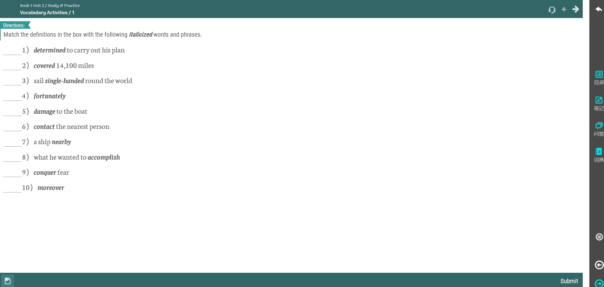
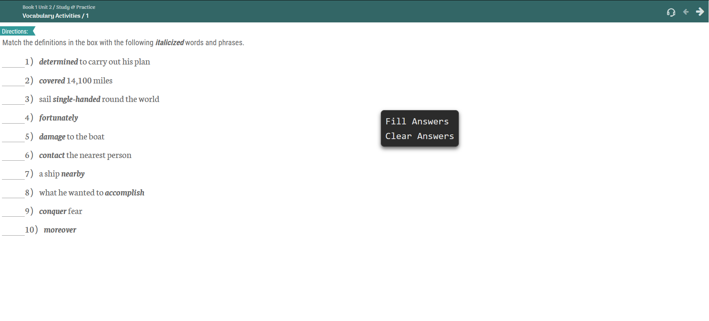
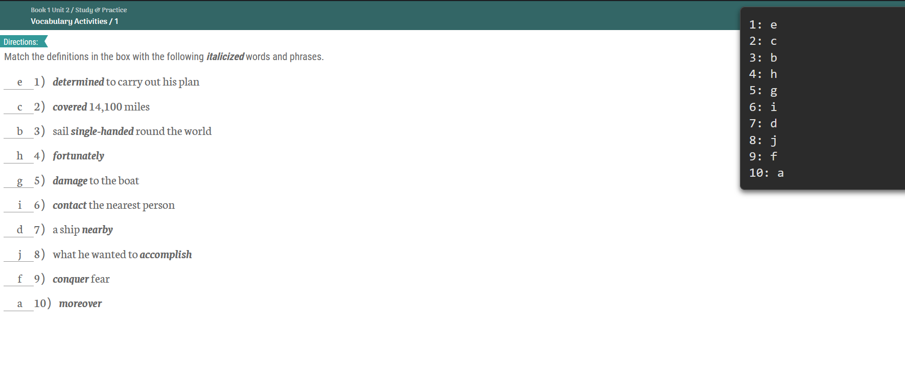
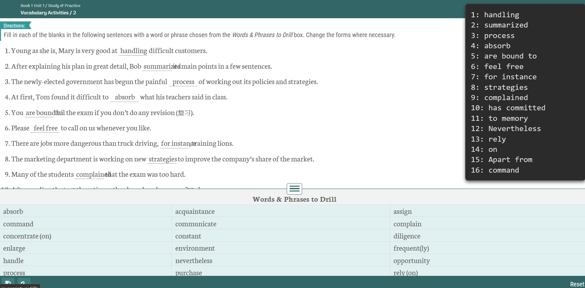

# WeNotLearn

WeNotLearn 是一个油猴脚本，主要用于Welearn练习题。其功能包括自动填充和清除答案，并通过浮动窗口在页面上显示相应的提示信息。

# 自动填充答案 && 清除答案

地址:https://raw.githubusercontent.com/MartinxMax/WeNotLearn/refs/heads/main/WeNotLearn.js

将js导入油猴后即可使用

进入练习题

右键选择填充答案

PS:你需要手动点击每一个选项后再提交,否则将判断未填写！